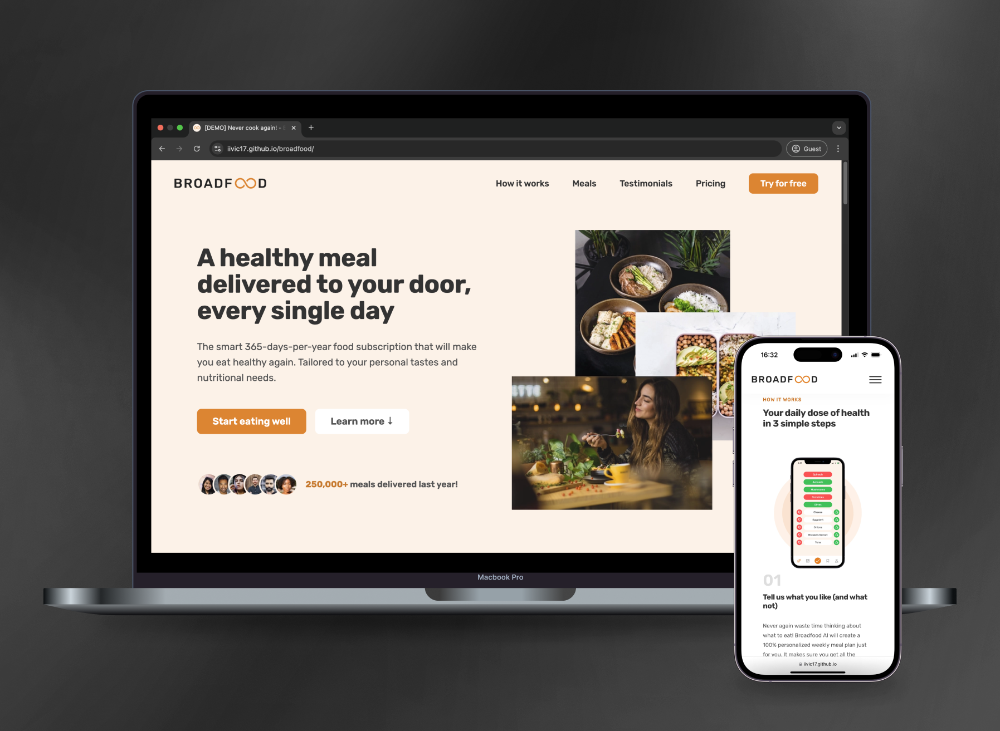

# Broadfood

Broadfood is a demo showcasing advanced front-end development skills through a responsive, visually engaging, and performant single-page application. The project demonstrates expertise in modern HTML, CSS, and JavaScript techniques, along with user-friendly design and interactivity.

## Features

### 🚀 User Interface and Interaction
- **Responsive Design**: Adaptable layout using **CSS Grid**, **Flexbox**, and **media queries** for a seamless experience across devices.
- **Smooth Scrolling**: Implemented with the **Scroll Behavior API** and JavaScript for enhanced navigation.
- **Sticky Navigation**: Dynamic sticky header controlled via the **Intersection Observer API**.

### 🎨 Styling and Components
- **Reusable Components**: Modular CSS structure with well-defined classes in `general.css` and `components.css`.
- **Custom Animations**: Button hover states, card scaling effects, and menu transitions for an interactive feel.
- **Mobile Navigation**: Toggleable mobile menu with a focus on accessibility and usability.

### 📊 Data and Performance
- **Dynamic Year Update**: Automated year display using JavaScript's `Date` API.
- **Preloaded Fonts and Images**: Optimized performance with `rel="preload"` and lazy loading techniques.

## Technologies

### JavaScript Features
- **Intersection Observer API**: Used for implementing sticky navigation when scrolling past the hero section.
- **Event Listeners**: Applied extensively for smooth scrolling and navigation toggles.

### CSS Techniques
- **CSS Variables**: Simplified theme management for consistent styling across components.
- **Media Queries**: Adaptive styles for various breakpoints, ensuring compatibility from small screens to large monitors.

### HTML and Metadata
- **SEO Optimization**: Proper use of semantic HTML tags and structured metadata for better visibility.
- **Progressive Web App Ready**: Includes a web manifest for PWA capabilities.
