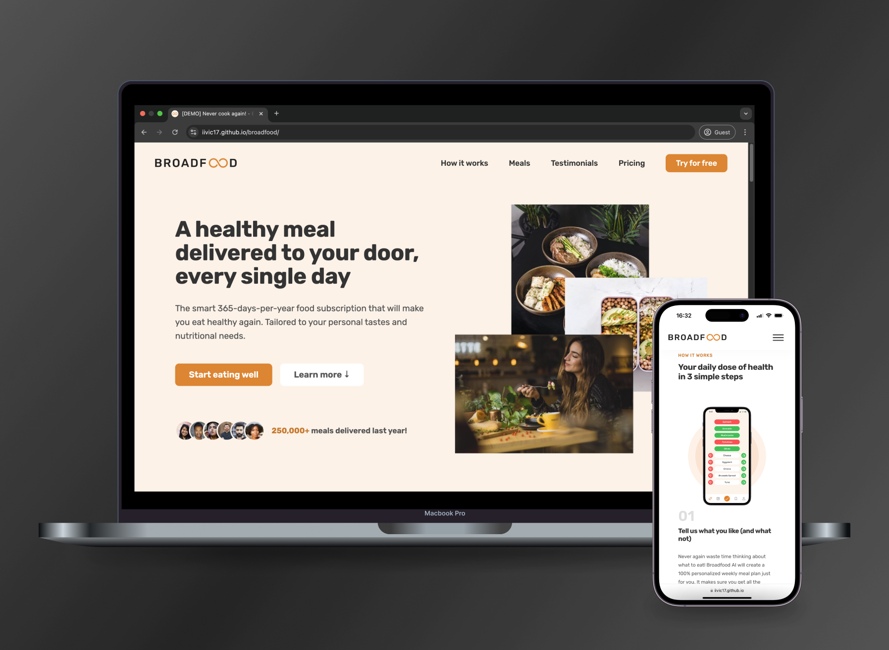

# Broadfood

Broadfood is a static landing page built with **vanilla HTML, CSS, and JavaScript**, focused on representing the most modern UI trends and patterns with a simple style guide.

## Features

### 🎨 Modern Design
- Implemented responsive layout using **CSS Grid**, **Flexbox**, and **media queries** to ensure compatibility across various devices.
- Utilized high-quality assets and gradients to create a visually appealing interface.

### ⚙️ Performance Enhancements
- Preloaded fonts and images using `rel="preload"` and lazy loading techniques for optimized loading times.
- Leveraged the **Intersection Observer API** for implementing sticky navigation, enhancing scroll performance.

### 🔄 Interactive Elements
- Added smooth scrolling with **JavaScript's Scroll Behavior API** for improved navigation experience.
- Developed a toggleable mobile menu using **event listeners** to enhance user interaction on smaller screens.

